# Устанавливаем minikube
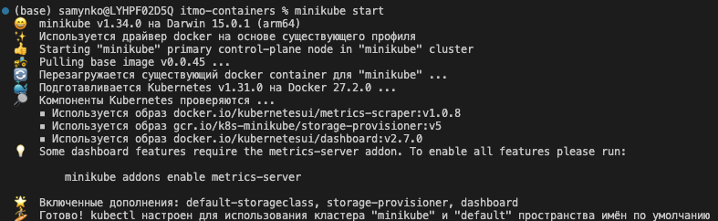

# Проверяем установку
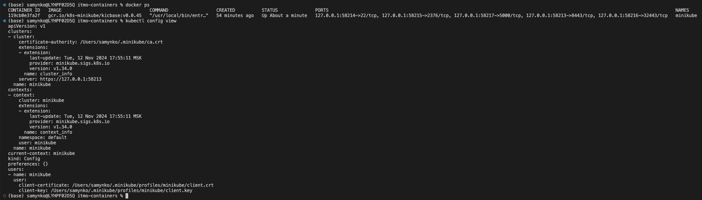

# Применяем манифесты
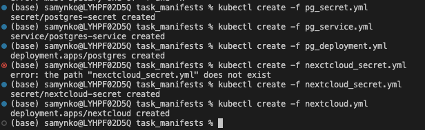

# Проверяем, что все установилось
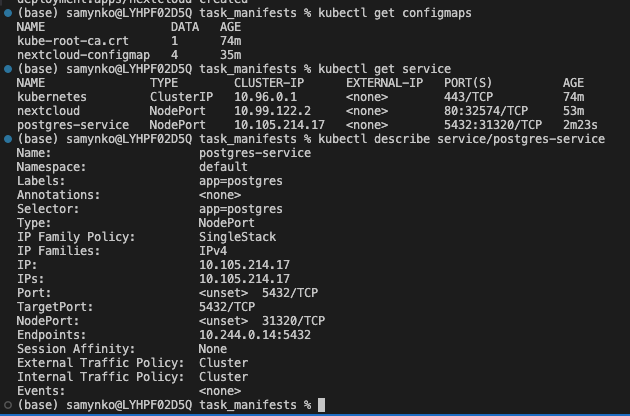

# Проверяем работу Nextcloud
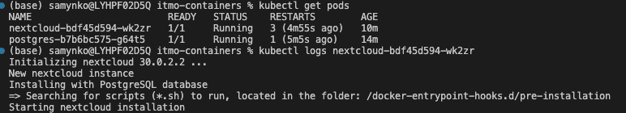
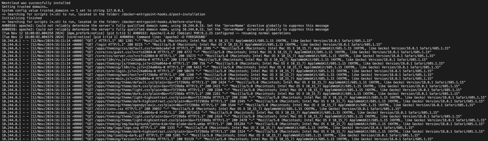

# Туннелируем трафик
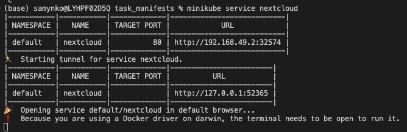

# Перходим по ссылке и проверяем работоспособность
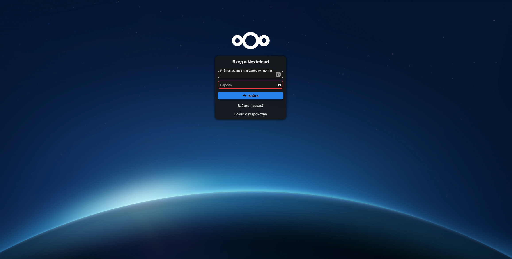

# Запускаем дашборд
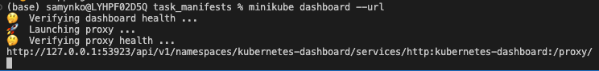
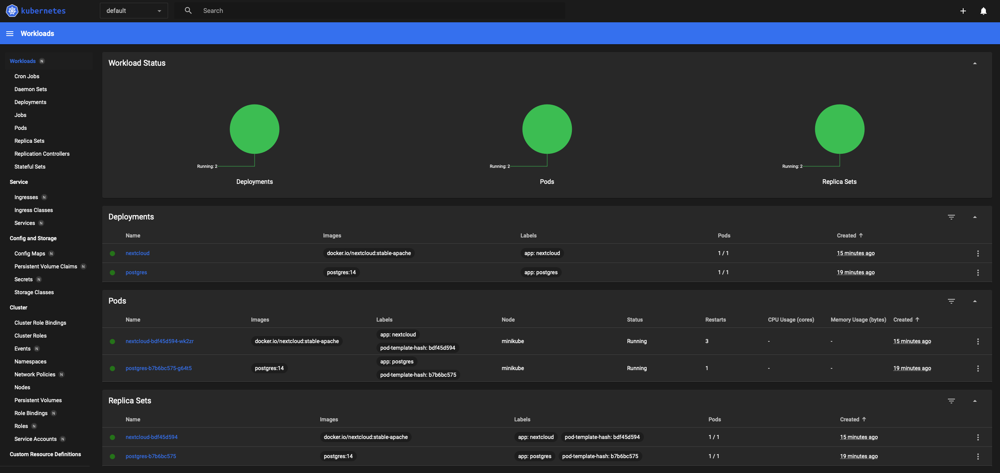

# Проваливаемся в поды и смотрим конфигурацию
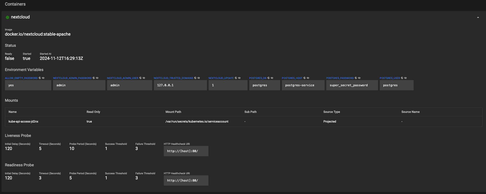
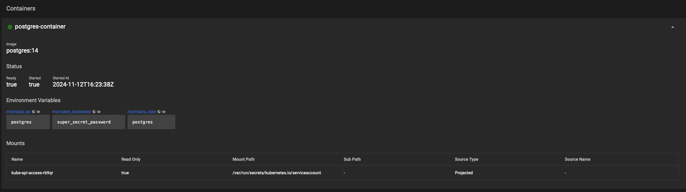

# Ответы на вопросы

## 1) Важен ли порядок выполнения этих манифестов? Почему?
### Порядок применения важен, так как cofigmap и secret должны быть созданы до применения deployment, потому что используются для конфигурации контейнера. Service нужно создавать до deployment для того, чтобы был доступ к pod'ам

## 2) Что (и почему) произойдет, если отскейлить количество реплик postgres-deployment в 0, затем обратно в 1, после чего попробовать снова зайти на Nextcloud?
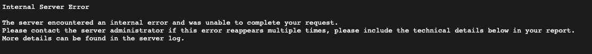
### При отскейливании количества реплик postgres-deployment в 0, база данных будет недоступна, и Nextcloud не сможет подключиться к ней. При обратном масштабировании в 1, Nextcloud будет видеть postgres, но не пытается заново подключиться к нему, поэтому необходимо перезапустить pod'ы Nextcloud.
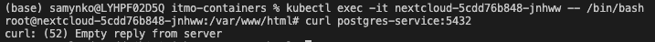
