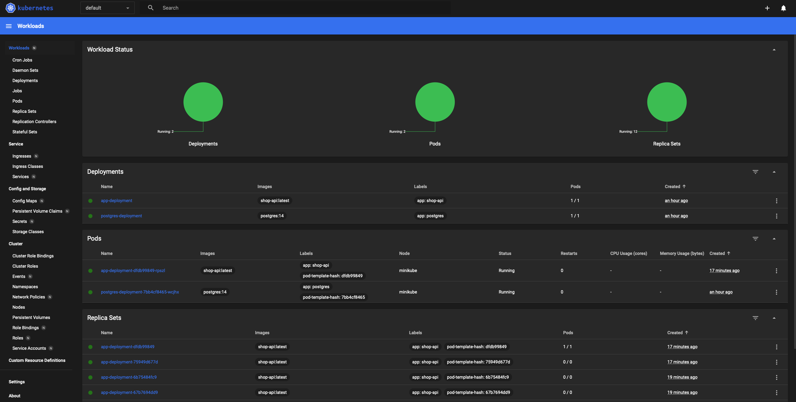
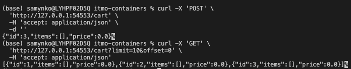
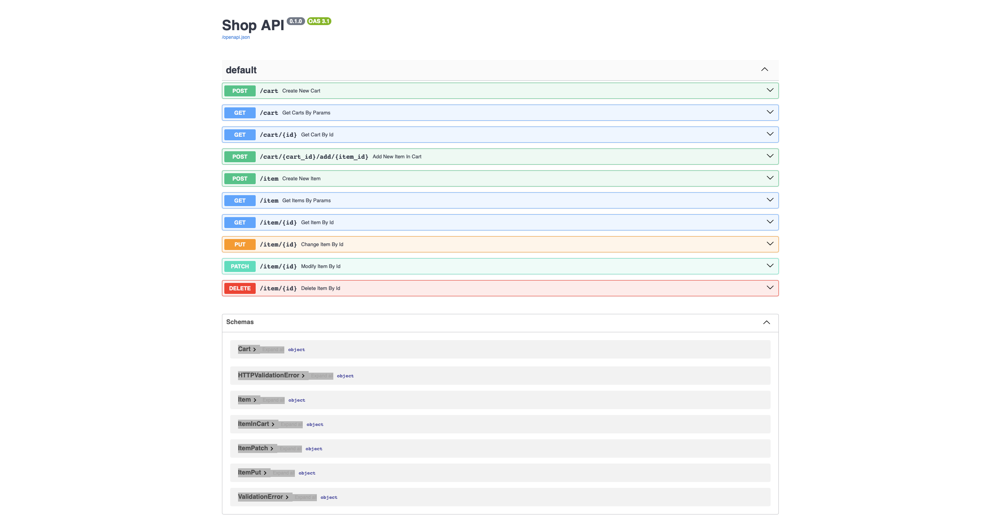

# Лабораторная работа 4

# Собственный сервис на Kubernetes

## Ход работы

### 0. Сборка и загрузка образа приложения в minikube
```
docker build -t shop-api:latest .
minikube image load shop-api:latest
```

### 1. Запуск minikube
```
minikube start
```

### 2. Применение манифестов configmap и secret
```
kubectl apply -f manifests/configmap.yaml
kubectl apply -f manifests/secret.yaml
```

### 3. Развертывание PostgreSQL
```
kubectl apply -f manifests/postgres/pvc.yaml
kubectl apply -f manifests/postgres/deployment.yaml
kubectl apply -f manifests/postgres/service.yaml
```

### 4. Развертывание приложения
```
kubectl apply -f manifests/app/deployment.yaml
kubectl apply -f manifests/app/service.yaml
```

### 5. Проверка подов
```
kubectl get pods
```

### 6. Тестирование сервиса
```
minikube service app-service --url
```

## Результат


